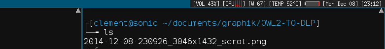

dwm-status2d
============

patch for DWM that allows colors and draw rectangle in the DWM status bar

Usage
=====

**^rx,y,w,h^**: Draw a rectangle of width w and height h, with its top left corner at (x,y) relative the X drawing cursor.

**^c#FF0000^**: Set foreground color.

**^b#55cdfc^**: Set background color, only applies to text, simply use the ^r^ command to change the background while drawing.

**^f<px>^**: Forward the X drawing cursor by <px> pixel. Please bear in mind that you have to move the cursor enough to display your drawing (by the with of your drawing).

**^d^**: Reset colors to SchemeNorm.

Examples
========

Basic one
---------
xsetroot -name "[status2d] ^c#FF0000^red text with blue rectangle^c#55cdfc^^r3,3,14,14^^f20^^c#FFFFFF^^b#f7a8b8^ and white text on pink background "

Draw a battery icon
-------------------
  
Draw the nose: "^r00,07,02,04^" Draw the battery: "^r02,04,22,10^" Fill it so that the border stays: "^c#000000^^r03,05,20,08^" Fill it with the remaining capacaty: "^c#ffffff^^r10,05,13,08^" Reset the colorscheme and forward the cursor: "^d^^f24^"

Put it all together: xsetroot -name "^r0,7,2,4^^r2,4,22,10^^c#000000^^r3,5,20,8^^c#ffffff^^r10,5,13,8^^d^^f24^"

Compatible dwmstatus program
============================

See my [dwmstatus](https://github.com/sipi/dwmstatus) repository for a compatible statusbar program (written in C).
